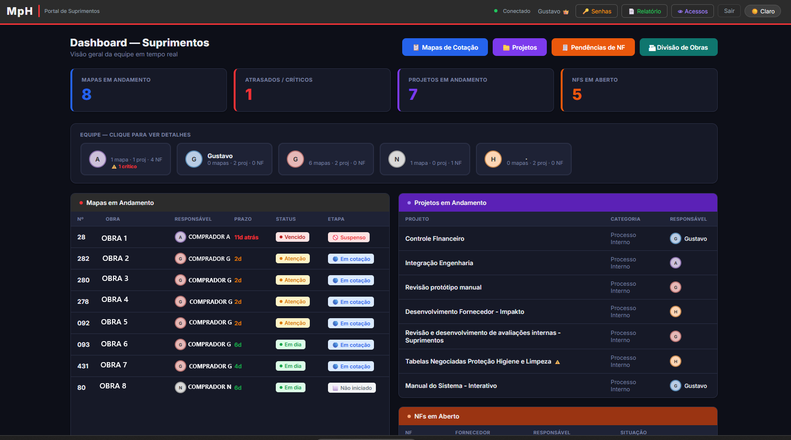
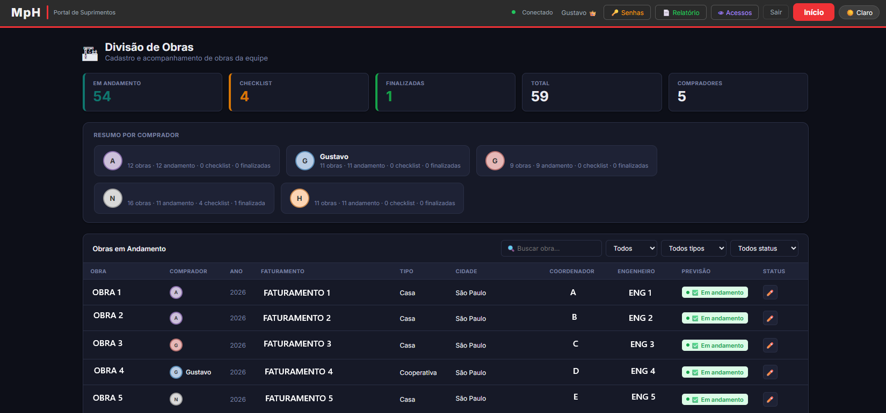
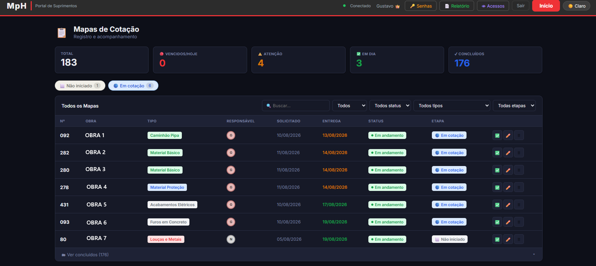
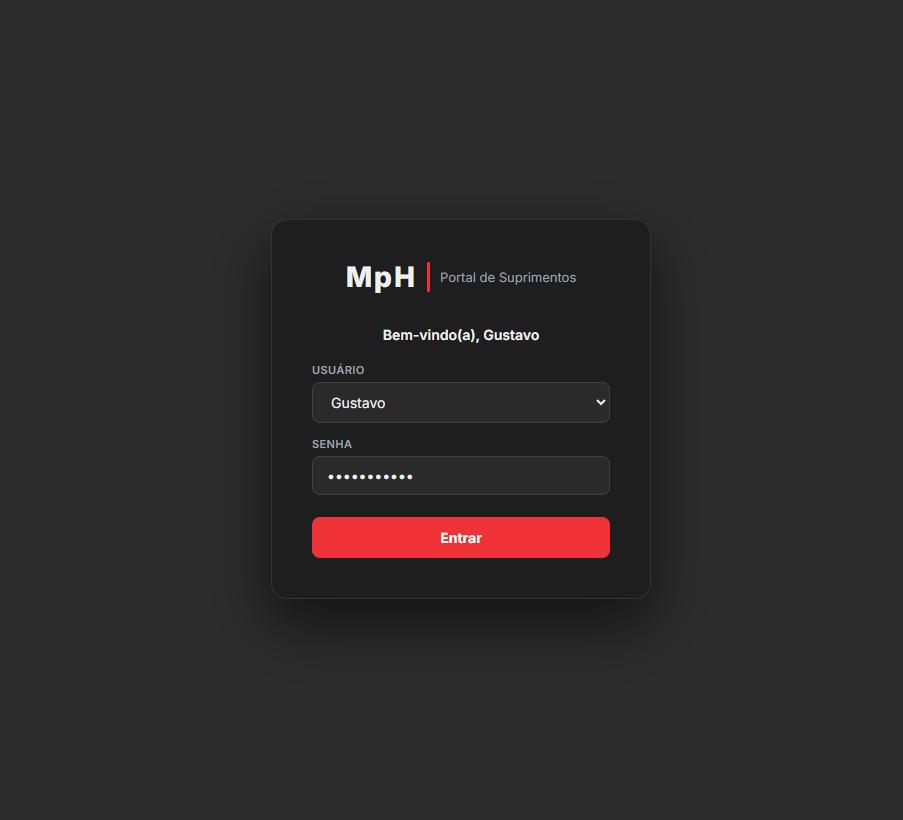
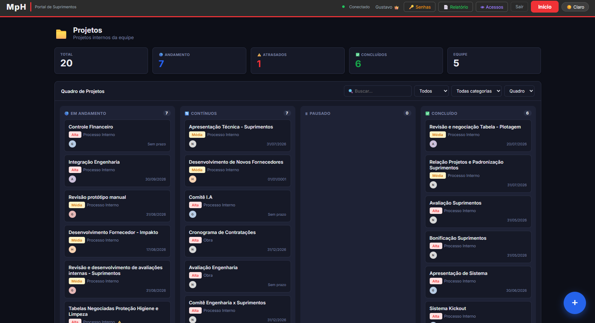
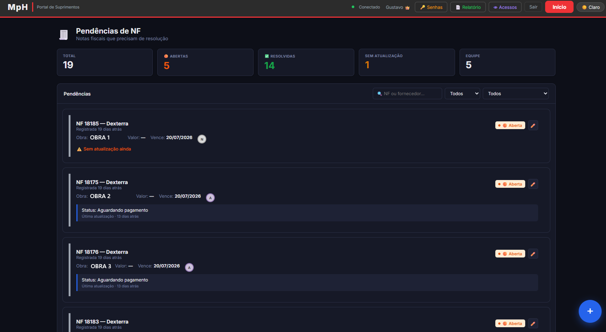

# Portal de Suprimentos

> Case study de um sistema de gestão de compras desenvolvido para uso interno em uma construtora, com dashboard de indicadores, controle de acesso por usuário e acompanhamento de pontualidade de fornecedores e obras simultâneas.

**Status:** em produção, uso diário pela equipe de Suprimentos
**Meu papel:** projetado e desenvolvido individualmente, do zero — da modelagem do banco de dados à interface
**Código-fonte:** não disponível publicamente (propriedade da empresa) — posso apresentar e explicar a arquitetura em detalhe em conversa/entrevista

---

## O problema

A área de Suprimentos de uma construtora com múltiplas obras em andamento (residencial e comercial, alto padrão) precisava de uma forma centralizada de:

- Acompanhar o desempenho e a pontualidade de fornecedores por obra
- Dar visibilidade de indicadores (KPIs) de compras para a liderança
- Organizar informações por obra sem depender de planilhas soltas e trocadas por e-mail
- Controlar quem acessa o quê, com histórico de acessos por usuário

Não existia uma ferramenta interna para isso — o processo era manual, fragmentado entre planilhas e conversas.

## A solução

Um portal web, acessado por login, com áreas e permissões diferentes para cada perfil de usuário (administradores e usuários padrão), organizado em módulos:

- **Dashboard / KPIs** — visão geral de indicadores de compras e desempenho
- **Divisão de Obras** — cadastro e navegação por obra, puxando dados de uma base própria de obras ativas
- **Relatórios em PDF** — geração de relatórios com acompanhamento de pontualidade de entregas/fornecedores
- **Controle de acesso** — login com senha para administradores e fluxo de primeiro acesso para novos usuários
- **Histórico de acessos** — cada login é registrado, com dados editáveis apenas por administradores

## Screenshots

| Dashboard | Divisão de Obras | Mapas de Cotação |
|---|---|---|
|  |  |  |

Ver mais telas (Login, Projetos, Pendências de NF)

**Login**

**Projetos**

**Pendências de NF**

## Stack técnico

- **Frontend:** HTML, CSS, JavaScript
- **Backend/Banco de dados:** Supabase (PostgreSQL), com autenticação e regras de acesso por linha (Row Level Security)
- **Deploy:** Vercel, com deploy automático a cada atualização
- **Geração de relatórios:** PDF gerado no próprio navegador a partir dos dados do sistema

## Desafios técnicos resolvidos

- **Controle de permissões por perfil de usuário:** diferentes níveis de acesso (administradores nomeados vs. primeiro acesso para novos usuários), com regras aplicadas tanto na interface quanto no banco de dados
- **Modelagem de dados por obra:** estrutura permitindo que cada obra tenha seus próprios registros de fornecedores, prazos e indicadores, sem misturar dados entre obras
- **Rastreabilidade:** todo acesso ao sistema é registrado, com edição de dados restrita a administradores — importante em um sistema que lida com informação sensível de fornecedores e valores
- **Geração de relatórios dinâmicos:** PDFs montados a partir dos dados reais do banco, incluindo cálculo de pontualidade por fornecedor/obra

## O que esse projeto mostra sobre como eu trabalho

Eu não parti de um requisito formal — identifiquei o problema no meu próprio dia a dia como comprador, desenhei a solução e construí sozinho, do banco de dados à interface, entregando uma ferramenta que a equipe usa todos os dias. É o mesmo processo que apliquei em outros projetos, sempre unindo experiência prática do problema de negócio com a construção da solução técnica.

---

*Quer saber mais sobre decisões de arquitetura, modelagem do banco ou desafios específicos? Fico à disposição para conversar em detalhe.*
